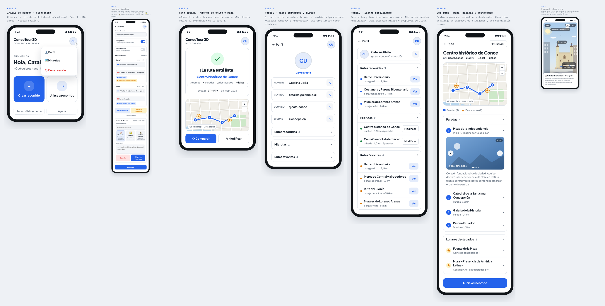
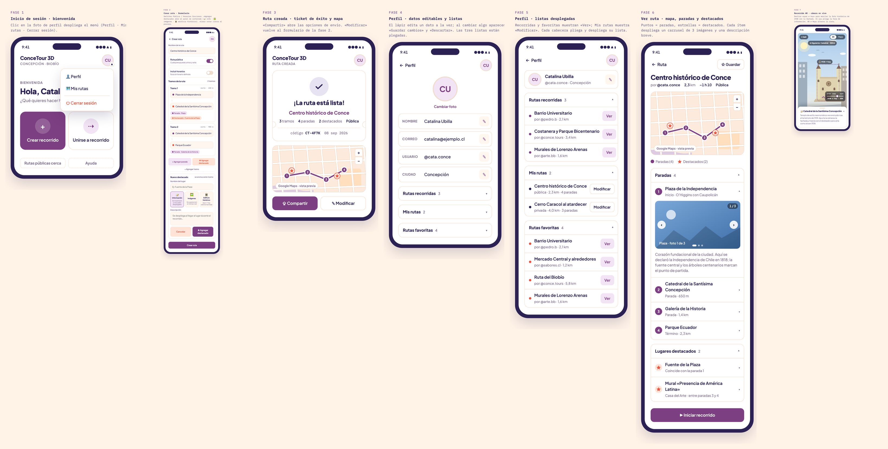
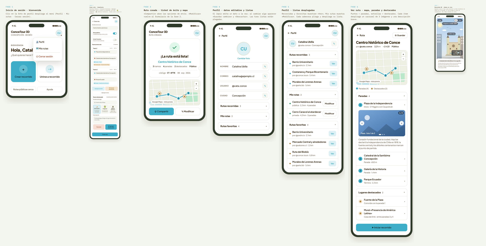
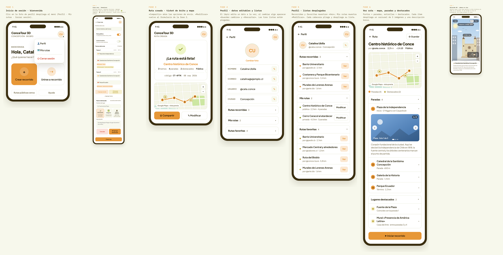
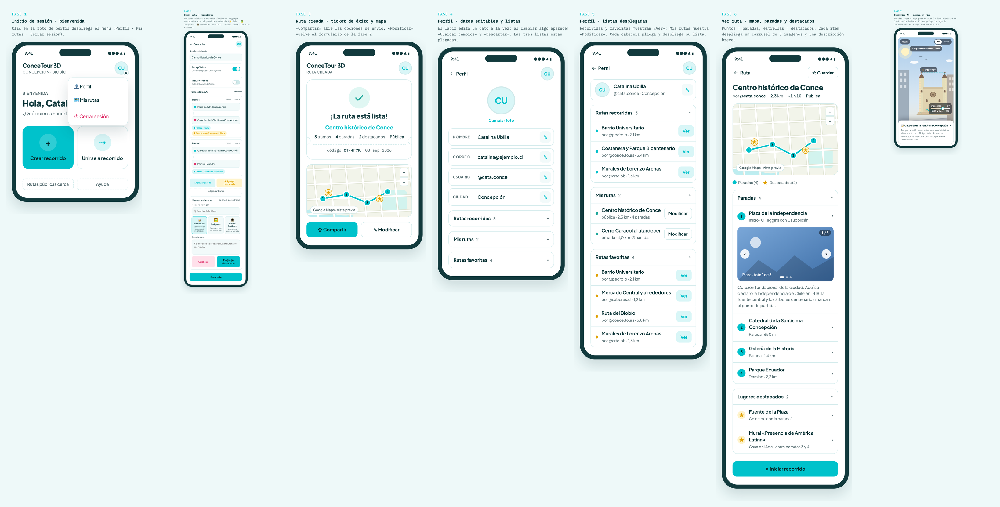

# conceTour3D

**ConceTour 3D** es una aplicación móvil de **realidad aumentada** para crear, compartir y recorrer rutas turísticas a pie por Concepción (Región del Biobío, Chile). Al iniciar un recorrido, la pantalla se convierte en una vista de cámara en vivo: **flechas en tiempo real** guían hacia la siguiente parada, la **información de cada lugar** aparece en un recuadro desplegable, y en los **edificios históricos** la imagen antigua se superpone a la fachada real como si el pasado se viera en tiempo real.

Este repositorio contiene la documentación de diseño del proyecto: el mockup interactivo del flujo completo (7 fases), la especificación de realidad aumentada, el sistema de paletas de color y la tipografía.

> Estado del proyecto: **diseño / prototipado** — aún no existe implementación de la app; el material aquí publicado es la base sobre la cual se construirá.

🌐 **[Ver los mockups interactivos](https://catau1625.github.io/conceTour3D/)** — publicado con GitHub Pages · [📦 Repositorio](https://github.com/catau1625/conceTour3D) · Licencia MIT

---

## Galería

Las cinco paletas del sistema sobre el flujo completo en 7 fases. En el sitio puedes cambiarlas en vivo con el selector o con `?paleta=…` en la URL.

| Estándar | Atardecer |
|----------|-----------|
|  |  |

| Bosque | Cítrica | Tropical |
|--------|---------|----------|
|  |  |  |

### Capturas del sitio publicado

Verificación visual del despliegue en GitHub Pages (septiembre 2026), disponible en [docs/capturas/](docs/capturas/):

- [Página del repositorio en GitHub](docs/capturas/github-readme.png) — README con galería y tabla de fases
- Mockup renderizado en cada paleta: [estándar](docs/capturas/mockup-estandar.png) · [atardecer](docs/capturas/mockup-atardecer.png) · [bosque](docs/capturas/mockup-bosque.png) · [cítrica](docs/capturas/mockup-citrica.png) · [tropical](docs/capturas/mockup-tropical.png)

---

## ¿Qué es ConceTour 3D?

Una app que permite a los usuarios:

- **Recorrer con realidad aumentada:** vista de cámara en vivo con flechas de dirección en tiempo real que guían el recorrido hacia la siguiente parada.
- **Descubrir lugares en contexto:** al llegar a una parada, su información aparece en un **recuadro desplegable** sobre la cámara, y sus imágenes se **superponen en tiempo real** ancladas al lugar.
- **Ver el «ayer y hoy» de los edificios:** en edificios históricos, la imagen antigua cargada por el creador se alinea sobre la fachada real con un deslizador de opacidad.
- **Crear recorridos** con tramos, paradas y destacados a los que se adjunta información, imágenes o pares de fotos históricas/actuales.
- **Unirse a recorridos** públicos mediante un enlace o código de invitación, y **compartir los propios** con un código corto (ej. `CT-4F7K`).
- **Guardar perfiles** con rutas recorridas, propias y favoritas.

La especificación completa de la experiencia AR está en [docs/realidad-aumentada.md](docs/realidad-aumentada.md).

## Flujo de diseño: 7 fases

Las siete fases están prototipadas en el mockup interactivo; la fase 7 usa una escena de cámara simulada en SVG.

| Fase | Pantalla | Descripción |
|------|----------|-------------|
| 1 | [Inicio / bienvenida](docs/flujo-de-fases.md#fase-1--inicio--bienvenida) | Menú de usuario, acceso rápido a crear o unirse a un recorrido |
| 2 | [Crear ruta](docs/flujo-de-fases.md#fase-2--crear-ruta) | Formulario con tramos, paradas, destacados con panel de contenido (📝 info · 🖼️ imágenes · 🏛️ edificios) y horarios |
| 3 | [Ruta creada](docs/flujo-de-fases.md#fase-3--ruta-creada) | Ticket de éxito con código de ruta, mapa y opciones de compartir |
| 4 | [Perfil](docs/flujo-de-fases.md#fase-4--perfil) | Datos editables y listas plegadas (recorridas, propias, favoritas) |
| 5 | [Perfil · listas desplegadas](docs/flujo-de-fases.md#fase-5--perfil-con-listas-desplegadas) | Las tres listas del perfil abiertas |
| 6 | [Ver ruta](docs/flujo-de-fases.md#fase-6--ver-ruta) | Mapa con paradas y destacados, cada uno con carrusel de 3 imágenes; CTA «Iniciar recorrido» |
| 7 | [Recorrido AR](docs/flujo-de-fases.md#fase-7--recorrido-ar) | Cámara en vivo simulada: flechas de navegación, hoja de información plegable, deslizador «ayer ⇄ hoy» y alternancia AR ⇄ Mapa |

## Sistema de diseño

- **Tipografía:** Plus Jakarta Sans (interfaz) e IBM Plex Mono (datos, códigos, leyendas).
- **Color:** 5 paletas intercambiables — Estándar (neutra, con modo oscuro), Atardecer, Bosque, Cítrica y Tropical. Detalle completo en [docs/paletas-de-color.md](docs/paletas-de-color.md).
- **Tokens semánticos:** `accent` (acciones y trazado de ruta), `ok` (éxito / rutas propias), `star` (destacados), `danger` (cerrar sesión / descartar), más tokens de mapa (tierra, calles, parque, agua — el río Biobío).

## Cómo ver los mockups

Abre el archivo directamente en un navegador:

```bash
open mockups/conceTour3D-fases.html
```

Los siete teléfonos del documento son **interactivos**: menús, switches, acordeones, botones de agregar paradas/tramos/destacados, carruseles y los controles de la fase 7 (deslizador «ayer ⇄ hoy», hoja plegable, selector AR ⇄ Mapa) responden al clic o al gesto.

### Probar las paletas de color

El selector de la cabecera permite cambiar la paleta de toda la lámina. También se puede forzar por URL:

```
mockups/conceTour3D-fases.html?paleta=atardecer
mockups/conceTour3D-fases.html?paleta=bosque
mockups/conceTour3D-fases.html?paleta=citrica
mockups/conceTour3D-fases.html?paleta=tropical
```

Sin parámetro se usa la paleta **Estándar** (única con modo oscuro automático vía `prefers-color-scheme`).

## Estructura del repositorio

```
conceTour3D/
├── README.md                      ← este archivo
├── LICENSE                        ← MIT © 2026 Catalina Ubilla Rubio
├── index.html                     ← entrada del sitio (GitHub Pages)
├── docs/
│   ├── flujo-de-fases.md          ← documentación detallada de las fases (1–7)
│   ├── realidad-aumentada.md      ← especificación de la experiencia AR
│   ├── paletas-de-color.md        ← paletas, tokens semánticos y tipografía
│   └── capturas/                  ← verificación visual del sitio publicado
├── mockups/
│   ├── conceTour3D-fases.html     ← mockup interactivo (HTML + CSS + JS, un solo archivo)
│   └── img/                       ← exportaciones PNG por paleta y fase
│       ├── estandar/              ← fase-01…fase-07 + lámina completa
│       ├── atardecer/
│       ├── bosque/
│       ├── citrica/
│       └── tropical/
└── conceTour3D-paletasTipo.pages  ← documento Pages con paletas y tipografía (fuente)
```

## Datos de ejemplo usados en el diseño

- **Usuario:** Catalina Ubilla · @cata.conce · Concepción
- **Ruta principal de muestra:** «Centro histórico de Conce» — 2,3 km, ~1 h 10, 4 paradas (Plaza de la Independencia, Catedral de la Santísima Concepción, Galería de la Historia, Parque Ecuador) y 2 destacados.
- **Código de ruta de muestra:** `CT-4F7K` → `concetour3d.app/r/CT-4F7K`

## Roadmap previsto

- [x] ~~Mockup de la fase 7 (recorrido AR)~~ — hecho: cámara simulada, flechas, hoja plegable y «ayer ⇄ hoy»
- [ ] Elección de stack con soporte AR: nativo (ARKit iOS / ARCore Android), multiplataforma (Unity AR Foundation, Flutter) o híbrido
- [ ] Estrategia de anclaje AR: fase 1 GPS + brújula, fase 2 reconocimiento de imagen por fachada
- [x] ~~UI de carga de contenido en destacados (fase 2)~~ — hecho: panel *Nuevo destacado* con 📝 información, 🖼️ imágenes y 🏛️ edificio histórico (imagen antigua + foto de referencia)
- [ ] Mapa real con cartografía de Concepción (reemplaza el mapa vectorial ilustrado del mockup)
- [ ] Sistema de cuentas y autenticación
- [ ] Códigos de invitación y enlaces públicos
- [ ] Flujo de permisos (cámara, ubicación, brújula) y degradación elegante sin AR
- [ ] Decisión final de paleta (la neutral es la base; las temáticas están en evaluación)

## Licencia

MIT — ver [LICENSE](LICENSE). © 2026 Catalina Ubilla Rubio.
