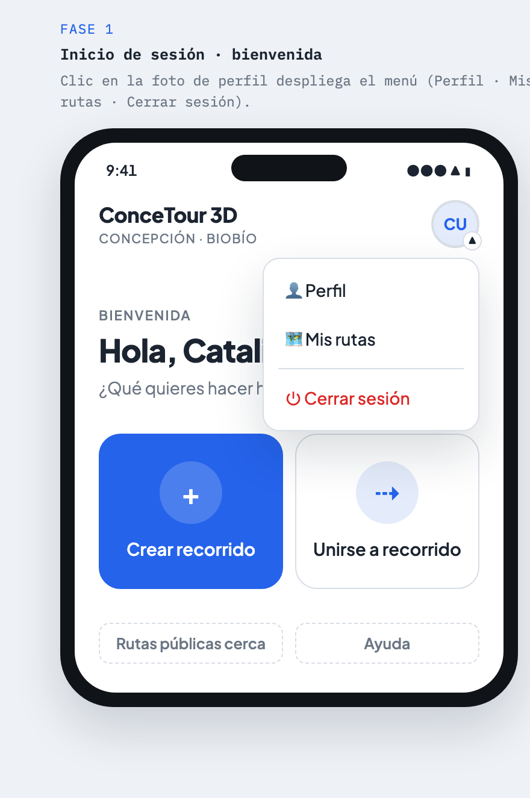
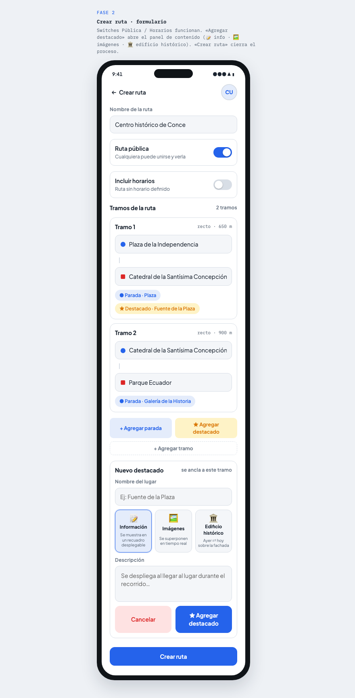
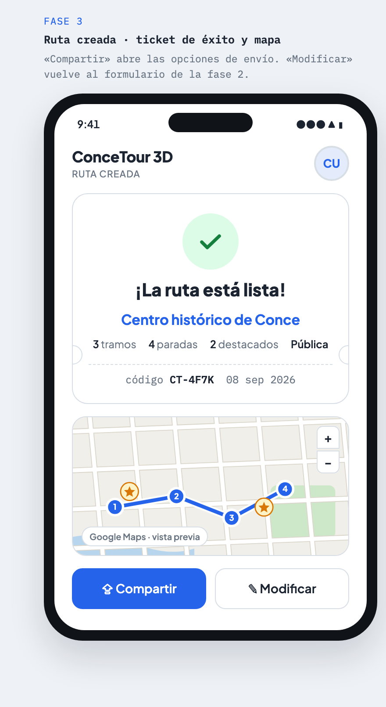
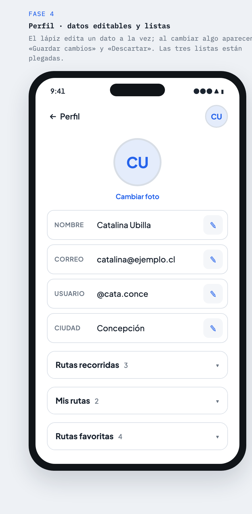
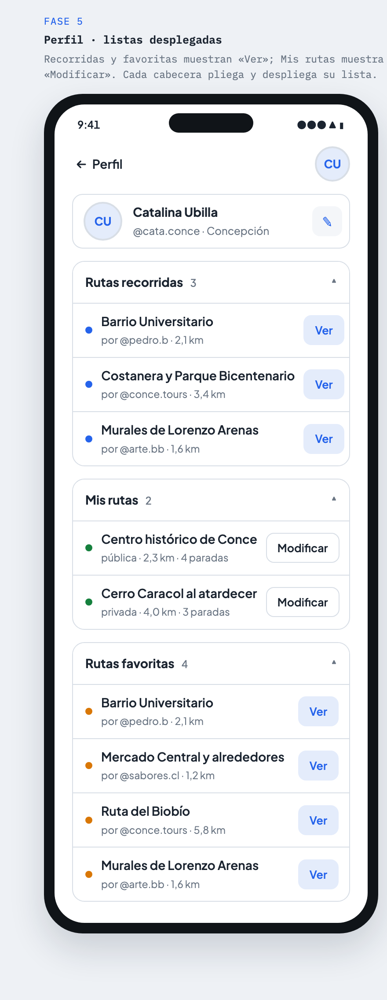
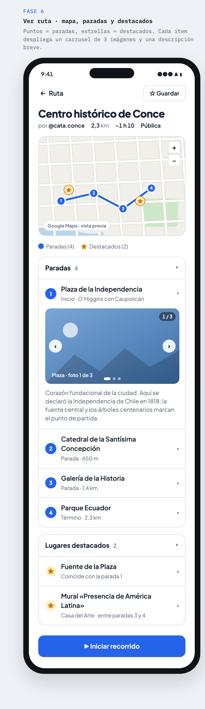

# Flujo de diseño: las 6 fases

Este documento describe pantalla por pantalla el flujo completo del mockup interactivo (`mockups/conceTour3D-fases.html`).

Cada fase se presenta como un teléfono funcional dentro de una lámina. Todos los controles responden al clic (menús, switches, acordeones, botones de agregar, carruseles), lo que permite validar la UX antes de escribir código de la app.

**Usuario de prueba:** Catalina Ubilla · @cata.conce · Concepción

---

## Fase 1 · Inicio / bienvenida

Pantalla de entrada tras iniciar sesión.

**Elementos:**

- **Topbar:** marca «ConceTour 3D» con subtítulo «Concepción · Biobío» y avatar de usuario con menú desplegable.
- **Menú de usuario** (clic en avatar): 👤 Perfil · 🗺️ Mis rutas · ⏻ Cerrar sesión (en `--danger`).
- **Saludo personalizado:** «Hola, Catalina 👋 — ¿Qué quieres hacer hoy en Concepción?»
- **Dos acciones principales en formato tile:**
  - ➕ **Crear recorrido** (botón primario) → lleva a la fase 2.
  - ⇢ **Unirse a recorrido** (secundario).
- **Acciones terciarias (ghost):** «Rutas públicas cerca» y «Ayuda».

**Decisión de diseño:** las dos acciones principales tienen el mismo peso visual en tamaño, pero solo «Crear» usa el color de acción; «Unirse» es el flujo de descubrimiento.



---

## Fase 2 · Crear ruta

Formulario de creación de ruta. Es la pantalla con más densidad de información.

**Elementos:**

- **Topbar** con volver (← Crear ruta) y avatar.
- **Nombre de la ruta:** campo de texto. Valor de ejemplo: «Centro histórico de Conce».
- **Ruta pública** (switch, activado): «Cualquiera puede unirse y verla» vs. «Privada · solo con enlace de invitación». El texto de ayuda cambia al alternar.
- **Incluir horarios** (switch): al activarlo se revela un bloque con:
  - Campos **Inicio** (10:00) y **Término** (12:30).
  - **Chips de días** L M X J V S D (L·X·V·S activados en el ejemplo).
- **Tramos de la ruta:** lista de tramos. Cada tramo muestra:
  - Cabecera: «Tramo N» + tipo y distancia (ej. «recto · 650 m»).
  - Campo de origen (● pin) y destino (■ pin).
  - Chips de paradas (●) y destacados (★) asociados al tramo.
- **Botones de agregar:** + Agregar parada · ★ Agregar destacado · + Agregar tramo (agregan elementos al formulario de forma dinámica en el mockup).
- **CTA fijo (sticky):** «Crear ruta» → muestra el toast «Ruta creada ✓» y representa la transición a la fase 3.

**Decisión de diseño:** el switch de horarios revela sus campos en lugar de mostrarlos siempre, manteniendo el formulario compacto cuando no aplican.



---

## Fase 3 · Ruta creada

Pantalla de confirmación tras crear la ruta.

**Elementos:**

- **Ticket de éxito** con check en `--ok`:
  - «¡La ruta está lista!»
  - Nombre de la ruta.
  - Metadatos: **3 tramos · 4 paradas · 2 destacados · Pública**.
  - Línea punteada tipo ticket con **código de ruta `CT-4F7K`** (en IBM Plex Mono) y fecha (08 sep 2026).
- **Mapa** con el trazado de la ruta (mapa vectorial ilustrado del mockup).
- **Acciones:** ⇪ **Compartir** (primario) y ✎ **Modificar** (vuelve al formulario de la fase 2).
- **Panel de compartir** (se despliega): 🔗 Copiar enlace · 💬 WhatsApp · ▦ Código QR, más caja con el enlace `concetour3d.app/r/CT-4F7K` y acción «copiar» (muestra toast «Enlace copiado»).

**Decisión de diseño:** el código corto + enlace es el mecanismo central de distribución; QR y WhatsApp son atajos, no flujos separados.



---

## Fase 4 · Perfil

Perfil de usuario con datos editables y tres listas plegadas.

**Elementos:**

- **Topbar** con volver (← Perfil).
- **Cabecera de perfil:** avatar grande (iniciales «CU») + «Cambiar foto».
- **Datos** (edición por campo, un dato a la vez):
  - Nombre — Catalina Ubilla
  - Correo — catalina@ejemplo.cl
  - Usuario — @cata.conce
  - Ciudad — Concepción
  - Cada fila tiene un lápiz (✎) que habilita la edición. Al modificar algo aparece la barra **Guardar cambios / Descartar**.
- **Tres acordeones, todos plegados:**
  - **Rutas recorridas (3):** rutas de otros usuarios que el usuario ha hecho, con botón «Ver».
  - **Mis rutas (2):** rutas propias con indicador `.mine` y botón «Modificar».
  - **Rutas favoritas (4):** rutas guardadas con indicador `.fav` y botón «Ver».

**Decisión de diseño:** las listas del perfil son acordeones para no competir con los datos personales; los indicadores de color distinguen propias (`.mine`) de favoritas (`.fav`) de recorridas.



---

## Fase 5 · Perfil con listas desplegadas

Mismo contexto que la fase 4, mostrando el estado con las tres listas abiertas.

**Elementos:**

- Cabecera compacta del perfil: avatar + nombre + @usuario · ciudad + lápiz.
- **Rutas recorridas (3)** desplegada:
  - Barrio Universitario — por @pedro.b · 2,1 km
  - Costanera y Parque Bicentenario — por @conce.tours · 3,4 km
  - Murales de Lorenzo Arenas — por @arte.bb · 1,6 km
- **Mis rutas (2)** desplegada:
  - Centro histórico de Conce — pública · 2,3 km · 4 paradas
  - Cerro Caracol al atardecer — privada · 4,0 km · 3 paradas
- **Rutas favoritas (4)** desplegada:
  - Barrio Universitario · Mercado Central y alrededores · Ruta del Biobío · Murales de Lorenzo Arenas

Cada cabecera de acordeón pliega/despliega su lista. «Ver» navega a la fase 6; «Modificar» vuelve a la fase 2.



---

## Fase 6 · Ver ruta

La pantalla principal de consumo: recorrer una ruta existente.

**Elementos:**

- **Topbar:** volver (← Ruta) y botón «☆ Guardar» (añade a favoritas).
- **Cabecera de ruta:** título + metadatos (por @cata.conce · 2,3 km · ~1 h 10 · Pública).
- **Mapa grande** con la leyenda: ● Paradas (4) · ★ Destacados (2).
- **Acordeón Paradas (4)** — cada parada despliega detalle:
  1. **Plaza de la Independencia** (Inicio · O'Higgins con Caupolicán) — carrusel de 3 imágenes + descripción histórica.
  2. **Catedral de la Santísima Concepción** (Parada · 650 m).
  3. **Galería de la Historia** (Parada · 1,4 km).
  4. **Parque Ecuador** (Término · 2,3 km).
- **Acordeón Lugares destacados (2)** — items estrella con la misma estructura de detalle.

**Sistema de marcadores:** punto numerado (`.mk`) = parada en orden de recorrido; estrella = destacado. Los carruseles del mockup usan gradientes de tema por parada (`data-theme-a/b`) como placeholder de fotografía real.

**Decisión de diseño:** el detalle de cada parada (carrusel + descripción) vive plegado dentro del acordeón para que el mapa y la lista de paradas queden visibles primero; el usuario despliega solo lo que le interesa.



---

## Mapa de navegación entre fases

```
Fase 1 (Inicio)
   │ ├─ Crear recorrido ──────────────► Fase 2 (Crear ruta)
   │ └─ Unirse a recorrido ───────────► (por definir: buscador / enlace de invitación)
   │
Fase 2 ── Crear ruta ────────────────► Fase 3 (Ruta creada)
   ▲                                       │
   └──────── Modificar ◄───────────────────┤
                                           ├─ Compartir (enlace / QR / WhatsApp)
                                           └─ (Ver ruta) ─────────────────► Fase 6 (Ver ruta)
Fase 1 ── menú Perfil ─────────────────► Fase 4 (Perfil, listas plegadas)
                                           └─ desplegar listas ──────────► Fase 5
Fase 4/5 ── Ver (recorridas/favoritas) ► Fase 6
Fase 4/5 ── Modificar (mis rutas) ─────► Fase 2
Fase 6 ── Guardar ─────────────────────► añade a «Rutas favoritas» del perfil
```

## Flujos aún no prototipados

- Unirse a un recorrido con código/enlace de invitación (entrada desde la fase 1).
- Buscador de rutas públicas cercanas.
- Escaneo de código QR como acceso directo a una ruta.
- Recorrido en vivo (navegación paso a paso con geolocalización).
